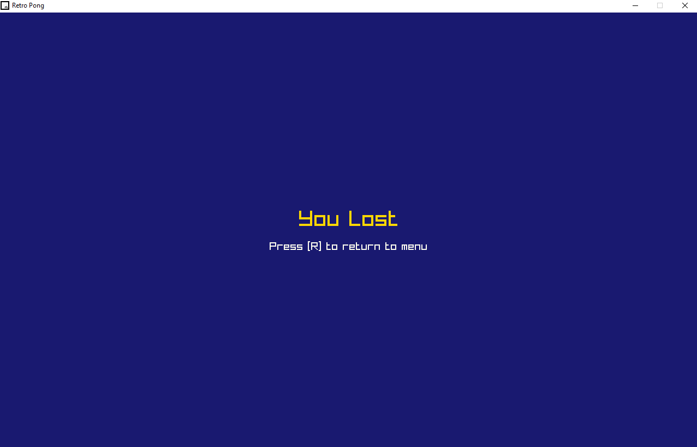
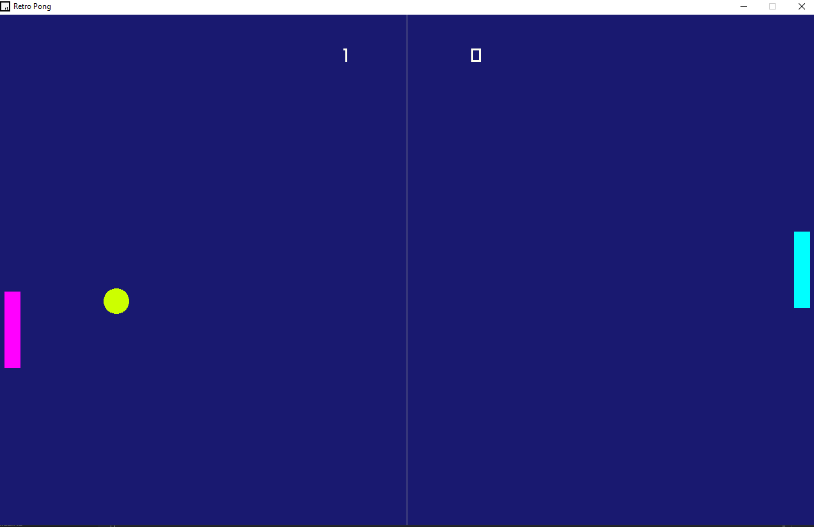
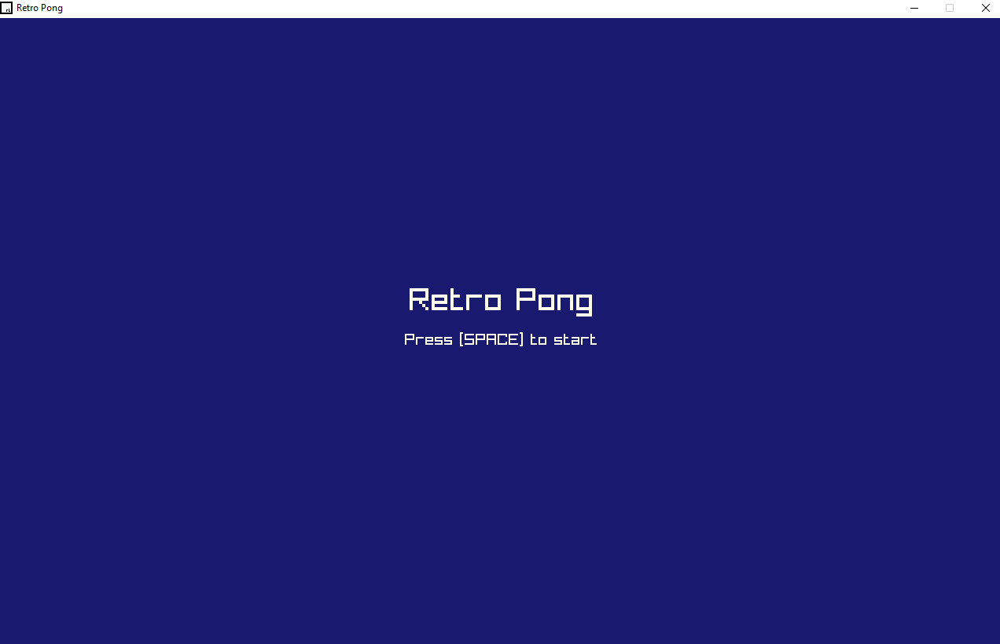

🕹️ Retro Pong
=============

Welcome to Retro Pong! 🎮  
A classic remake of the legendary *Pong*, created in C++ using the [raylib](https://www.raylib.com/) library.  
It features a retro interface, basic CPU paddle AI, a main menu, and win condition.

🎯 Features
-----------
- 🎨 Retro-style custom color palette
- 🎾 Realistic collisions and dynamic ball movement
- 🤖 CPU paddle with basic AI tracking
- 🏆 First to reach **7 points** wins
- 🧭 Main menu and victory screen

📷 Screenshots
--------------

- 
- 
- 

🧪 Requirements
---------------
- C++
- raylib installed → https://github.com/raysan5/raylib

⚙️ Compilation
--------------
```bash
g++ main.cpp -o retro_pong -lraylib -lGL -lm -lpthread -ldl -lrt -lX11
```

🕹️ Controls
------------
| Action             | Key               |
|--------------------|-------------------|
| Move up            | ↑ (Up arrow)      |
| Move down          | ↓ (Down arrow)    |
| Start game         | Space             |
| Restart game       | R                 |
| Exit               | Esc               |

🚀 Run
-----
```bash
./retro_pong
```

📁 Project Structure
--------------------
retro_pong/
│
├── main.cpp          # Main source code
├── README.txt        # This file
└── assets/           # Folder for images or other assets

📘 Documentation
----------------
- `main.cpp`: contains the entire logic of the game, including game state, rendering, AI behavior, collision detection, and score tracking.
- CPU paddle behavior is implemented using basic vertical tracking.
- Game has 3 states: MENU, PLAYING, GAMEOVER.

❤️ Credits
----------
- Created with retro love by [Nilfred]
- Graphics library: raylib → https://github.com/raysan5/raylib

🧠 Inspiration
--------------
This project was inspired by a love for recreating arcade classics from the 70s and a desire to learn more about game development in C++.

📦 License
----------
MIT License
